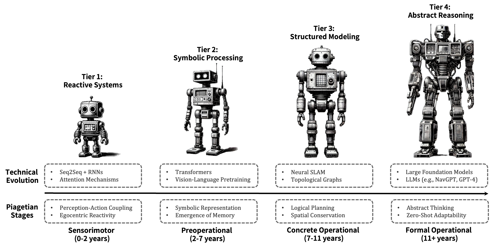

# VLN Cognitive Development Hub



Welcome to the **VLN Cognitive Development Hub**, the official repository for "**From Perception to Reasoning: A Survey of Vision-and-Language Navigation Through Cognitive Development**" (2025), a groundbreaking survey that reimagines Vision-and-Language Navigation (VLN) through Piaget's cognitive developmental stages. This repository organizes VLN research into four evolutionary phases—Sensorimotor, Preoperational, Concrete Operational, and Formal Operational—offering a unified perspective on the field's progression from reactive systems to abstract, human-like navigational intelligence.

## 🎉 Status Update
Our survey is under review—stay tuned for publication updates!

## Introduction
Vision-and-Language Navigation (VLN) tasks agents with navigating photorealistic environments using natural language instructions, a challenge at the nexus of computer vision, natural language processing, and embodied AI. This survey introduces a novel top-down framework, aligning VLN's technical milestones with Piaget's cognitive stages: from reactive sensorimotor mappings (e.g., Seq2Seq) to symbolic preoperational processing (e.g., HAMT), structured concrete operational planning (e.g., Neural SLAM), and abstract formal operational reasoning (e.g., NavGPT). By integrating cognitive science with VLN, we:
- Document the field's cognitive maturation.
- Highlight foundation models' transformative role.
- Propose a roadmap for human-like navigational fluency.

This repository curates papers, models, datasets, and metrics, categorized by developmental stage, to support researchers exploring VLN's past, present, and future.

## Citation
If this repository or our framework aids your research, please consider citing:

```bibtex
@article{gao2025perception,
    title={From Perception to Reasoning: A Survey of Vision-and-Language Navigation Through Cognitive Development},
    author={Gao, Peng and Wang, Peng and Fujita, Hamido and Wang, Fei and Yuan, Ru-Yue},
    journal={}, 
    year={2025},
    volume={},  
    number={},  
    pages={},   
    publisher={Elsevier}, 
    doi={},     
}
```

🔔 We'll keep this hub updated! To suggest inclusions or provide feedback, email [emal@example.com] or raise an issue. Your input ensures this resource evolves with the field.

## Cognitive Framework
Our survey reframes VLN's evolution through Piaget's stages:

### Sensorimotor Stage: Reactive Navigation
- **Traits**: Egocentric perception, no object permanence.
- **Tech**: Seq2Seq + Attention [Anderson et al., 2018].
- **Focus**: Immediate perception-action loops.

### Preoperational Stage: Symbolic Processing
- **Traits**: Symbolic understanding, emerging memory.
- **Tech**: Transformer-based models [e.g., HAMT, Chen et al., 2021].
- **Focus**: Instruction parsing, limited spatial awareness.

### Concrete Operational Stage: Structured Navigation
- **Traits**: Spatial conservation, logical planning.
- **Tech**: Neural SLAM [Chaplot et al., 2020], HOP [Qiao et al., 2022].
- **Focus**: Persistent maps, subgoal sequencing.

### Formal Operational Stage: Abstract Navigation
- **Traits**: Hypothetical reasoning, zero-shot adaptability.
- **Tech**: LLMs like NavGPT [Zhou et al., 2024], MapGPT [Chen et al., 2024].
- **Focus**: Generalization, interactive planning.

See our [survey paper](#link-to-paper) for an in-depth analysis.

---

## Contents
- [Related Surveys](#related-surveys)
- [Sensorimotor Stage Resources](#sensorimotor-stage-resources)
- [Preoperational Stage Resources](#preoperational-stage-resources)
- [Concrete Operational Stage Resources](#concrete-operational-stage-resources)
- [Formal Operational Stage Resources](#formal-operational-stage-resources)

---

## Related Surveys
| Title | Venue | Date | Link/Code |
|:------|:-----:|:----:|:---------:|
| **[Vision-and-Language Navigation Today and Tomorrow: A Survey in the Era of Foundation Models](https://arxiv.org/pdf/2407.07035)** | TMLR | 2024 | [GitHub](https://github.com/ZJLAB-AMMI/VLN-Survey) |
| **[Vision-and-Language Navigation: A Survey of Tasks, Methods, and Future Directions](https://arxiv.org/abs/2203.12667)** | ACL | 2022 | [GitHub](https://github.com/eric-ai-lab/awesome-vision-language-navigation) |
| **[Vision-Language Navigation: A Survey and Taxonomy](https://arxiv.org/abs/2108.11544)** | - | 2021 | - |

---

## Sensorimotor Stage Resources
Foundational VLN systems with reactive perception-action mappings.

| Title | Venue | Date | Link/Code |
|:------|:-----:|:----:|:---------:|
| **[Vision-and-Language Navigation (R2R)](https://arxiv.org/abs/1711.07280)** | CVPR | 2018 | [GitHub](https://github.com/peteanderson80/Matterport3DSimulator) |
| **[Speaker-Follower Models for Vision-and-Language Navigation](https://arxiv.org/abs/1806.02724)** | NeurIPS | 2018 | - |
| **[Self-Monitoring Navigation Agent via Auxiliary Progress Estimation](https://arxiv.org/abs/1901.07407)** | ICLR | 2019 | - |

---

## Preoperational Stage Resources
Symbolic processing with emerging memory and instruction parsing.

| Title | Venue | Date | Link/Code |
|:------|:-----:|:----:|:---------:|
| **[History Aware Multimodal Transformer for Vision-and-Language Navigation](https://arxiv.org/abs/2110.13309)** | NeurIPS | 2021 | [GitHub](https://cshizhe.github.io/projects/vln_hamt.html) |
| **[VLN BERT: A Recurrent Vision-and-Language BERT for Navigation](https://arxiv.org/abs/2011.13922)** | CVPR | 2021 | [GitHub](https://github.com/YicongHong/Recurrent-VLN-BERT) |
| **[Towards Learning a Generic Agent for Vision-and-Language Navigation via Pre-training](https://arxiv.org/abs/2002.10638)** | CVPR | 2020 | [GitHub](https://github.com/weituo12321/PREVALENT) |

---

## Concrete Operational Stage Resources
Structured spatial modeling and logical planning.

| Title | Venue | Date | Link/Code |
|:------|:-----:|:----:|:---------:|
| **[Learning Object-Contextualized Representations with Neural SLAM](https://arxiv.org/abs/2002.04421)** | CVPR | 2020 | - |
| **[HOP: History-and-Order Aware Pre-training for Vision-and-Language Navigation](https://arxiv.org/abs/2203.14832)** | CVPR | 2022 | [GitHub](https://github.com/YanyuanQiao/HOP-VLN) |
| **[EnvEdit: Environment Editing for Vision-and-Language Navigation](https://arxiv.org/abs/2203.15685)** | CVPR | 2022 | [GitHub](https://github.com/jialuli-luka/VLN-SIG) |

---

## Formal Operational Stage Resources
Abstract reasoning and zero-shot navigation with foundation models.

| Title | Venue | Date | Link/Code |
|:------|:-----:|:----:|:---------:|
| **[NavGPT: Explicit Reasoning in Vision-and-Language Navigation with Large Language Models](https://arxiv.org/abs/2305.16986)** | CVPR | 2023 | - |
| **[MapGPT: Map-Guided Prompting with Adaptive Path Planning for Vision-and-Language Navigation](https://arxiv.org/abs/2401.07314)** | ACL | 2024 | [GitHub](https://chen-judge.github.io/MapGPT/) |
| **[NavGPT-2: Unleashing Navigational Reasoning Capability for Large Vision-Language Models](https://arxiv.org/abs/2407.12366)** | ECCV | 2024 | [GitHub](https://github.com/GengzeZhou/NavGPT-2) |
| **[Towards Learning a Generalist Model for Embodied Navigation](https://arxiv.org/abs/2312.02010)** | CVPR | 2024 | [GitHub](https://github.com/LaVi-Lab/NaviLLM) |

---

## How to Contribute
We invite the VLN community to enrich this hub:
1. **Suggest Resources**: Propose papers, datasets, or code via issues or email.
2. **Add Content**: Submit pull requests with categorized entries.
3. **Discuss Ideas**: Share insights on advancing VLN's cognitive arc.

## Future Vision
This repository will grow with:
- Implementations of proposed metrics (e.g., Subgoal Completion Rate).
- Visualizations of VLN's developmental stages.
- Case studies on real-world VLN deployment.

Join us in shaping VLN's journey toward artificial general intelligence!

---

